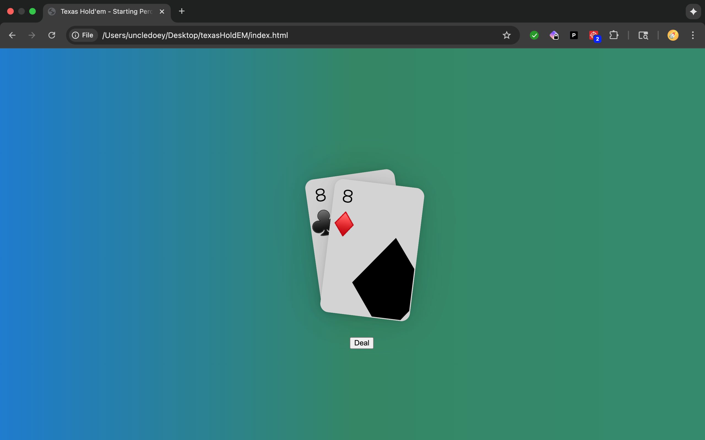

# Texas Hold'em Starting Hand Calculator

A fun and interactive web app that displays your Texas Hold'em starting hand and calculates your win probability in a heads-up scenario.



## Features

- **Random Card Dealing**: Click "Deal" to get two random starting cards with suits
- **Heads-Up Win Probability**: See your percentage chance to win against one opponent
- **Smooth Animations**: Cards slide in with rotation effects
- **Interactive UI**: Hover over cards to see subtle transformations

## How It Works

The app uses pre-calculated probabilities based on poker simulations for all 169 possible Texas Hold'em starting hands. When you deal cards, it:

1. Randomly generates two cards with suits
2. Determines your hand notation (e.g., "AKs" for Ace-King suited, "72o" for 7-2 offsuit)
3. Looks up the win percentage against a single random opponent
4. Displays the probability on screen

## Tech Stack

- **HTML5** - Structure
- **CSS3** - Styling with custom animations and gradients
- **Vanilla JavaScript** - Card logic and probability calculations

## Project Structure

```
/texasHoldEM
  ├── index.html          # Main HTML structure
  ├── styles.css          # All styling and animations
  ├── script.js           # Card dealing and UI logic
  └── headsUp.js          # Hand evaluation and probability data
```

## Current Status

**Working:** Heads-up (2 player) win probability calculator

**Future Plans:**
- Add multi-player probabilities (3-9 players)
- Show hand strength rankings
- Add visual breakdown comparing different table sizes
- Include pre-flop action recommendations (fold/call/raise)

## Development Notes

This project was built as a learning exercise in JavaScript fundamentals. The probability calculations and hand notation logic were developed with assistance from Claude (Anthropic), while the UI design, styling, and implementation were done independently.

**Key Learning Areas:**
- Object lookups and data structures
- Function composition and modular code organization
- Array destructuring for value swapping
- Ternary operators for conditional logic
- Working with multiple JavaScript files

## How to Run

Simply open `index.html` in any modern web browser. No build process or dependencies required!
